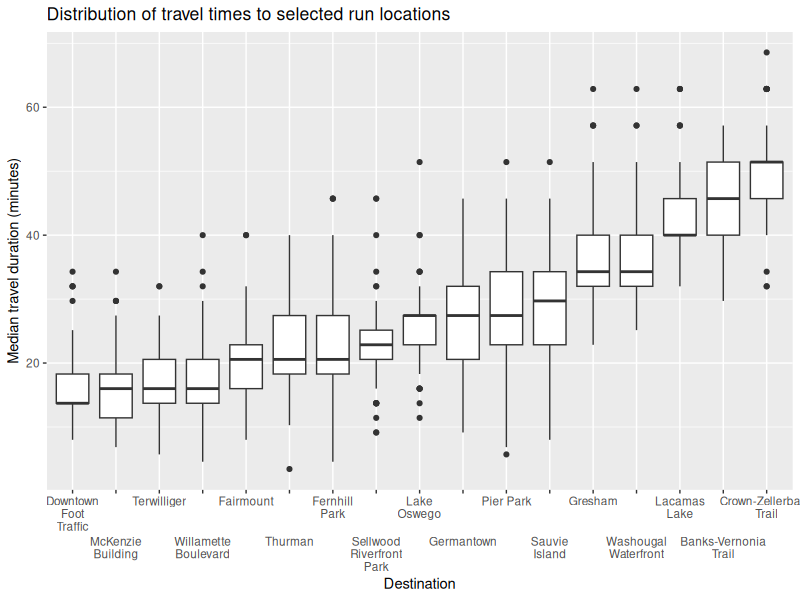
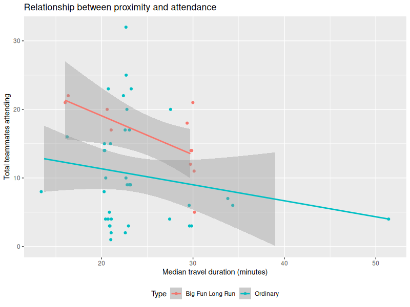

Uses travel times to identify suitable locations for Rose City Track Club team long runs.  The [Distancematrix.ai](https://distancematrix.ai) service is used to calculate travel times to select long run locations.  This information can be used to quantify how centrally located each loation is.

This repository contains three key components:
- An API caller for Distancematrix.ai written in Python
- An R script that summarizes the range of travel times to long run locations (Figure 1)
- An R script that regresses long run attendance on median travel duration (Figure 2)

For privacy reasons no personally identifying information is stored in this repository and the data used is presented only in summary form.

Figure 1.  Boxplots shwoing distribution of travel times to long run locations.  Locations are sorted first by median, than by third quartile, than by mximum.

Figure 2.  Regression of long run attendance on median travel duration, divided into ordinary long runs and Big Fun Long Runs.  While a negative correlation between proximity and attendance is expected there is considerable variation.